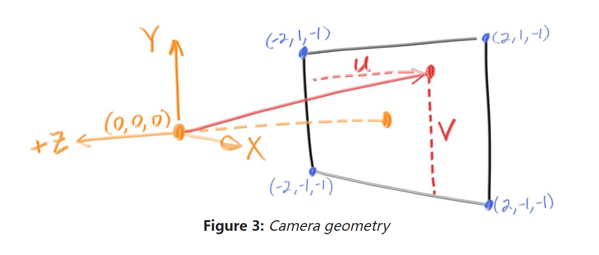
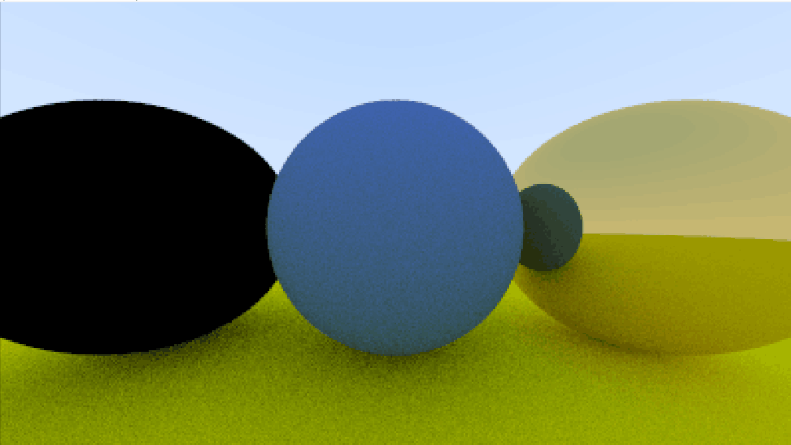
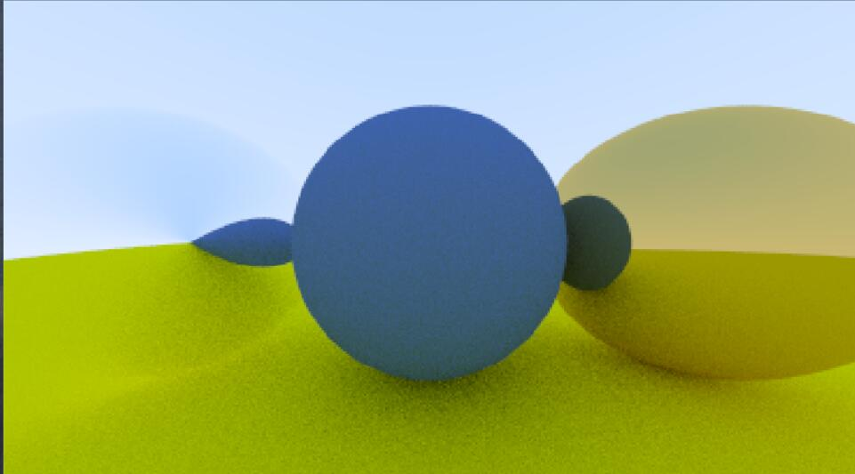
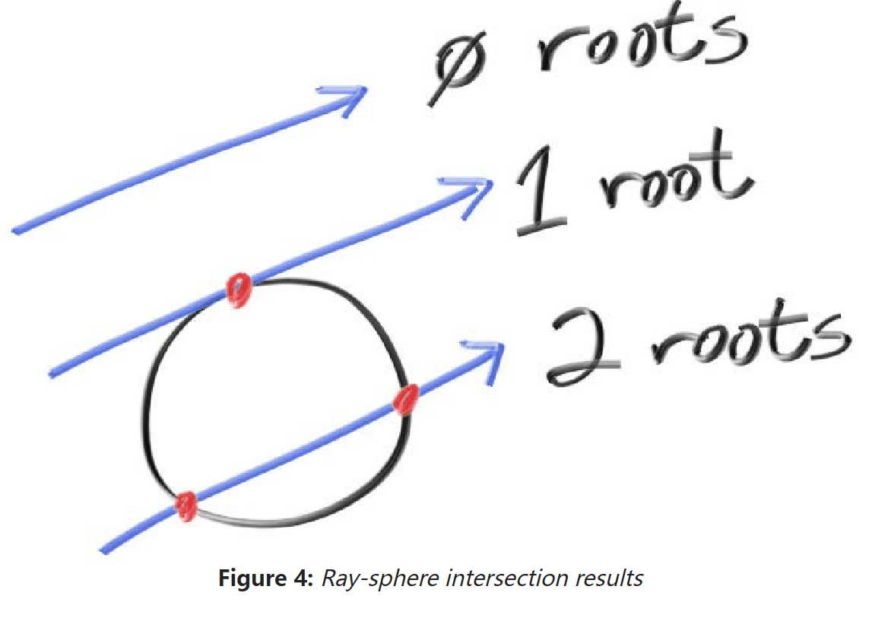
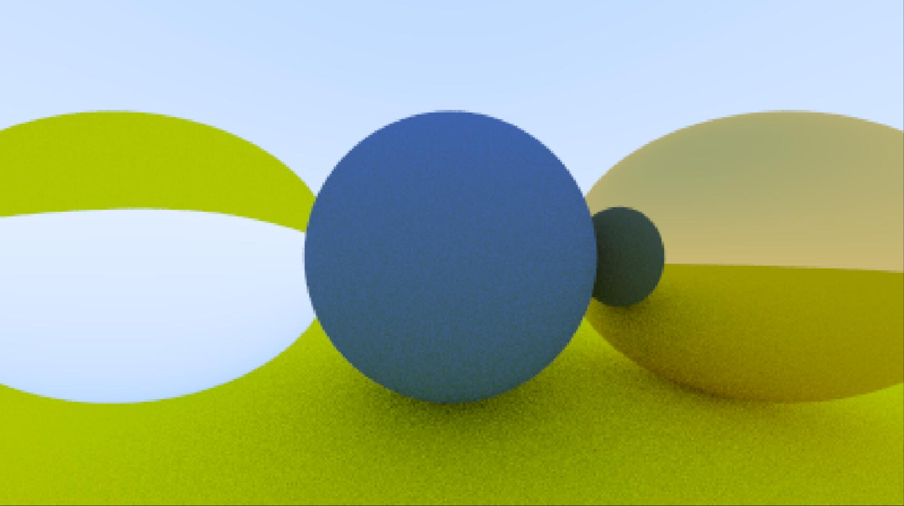

# debug 日记

最近在使用 rust 照着 Ray Tracing In One Weekend 写一版代码，一开始都很顺利，但是在做到折射的部分的时候出现了奇怪的状况。

首先对之前做的事情先做一个简要的介绍吧，我们在场景中渲染了几个球，为它们添加了漫反射材质和金属材质，到目前为止一切顺利，效果如下图。


这些都是利用光线追踪实现的，上面的图片的宽度是 400，长宽比为 16:9，也就是说，这张图是由 400\*225 个像素点组成的，要得到这张图片，只需要知道每一个像素点对应的颜色即可。

大致的原理就是构建一个相机空间坐标系，然后有一个平面对应我们的图像，然后放上几个球，接着从相机坐标出发向每一个像素点对应的方向发射一条射线，计算其路径上的遮挡和各种折射反射之后，得到最后这一点的颜色，然后就可以渲染出整张图片了。



我们首先实现的是各种基础的类型与结构，包括三维向量 Vec3 及其各种运算，而点和颜色也都可以使用 Vec3 的结构来表示，此外我们还实现了可被光线打中的物体，用 hittable 来表示，物体还有对应的材质 material，在 rust 中，使用 trait 定义这两类的行为 hit 和 scatter，物体被光线击中后根据自身材质不同对光线产生不同的散射行为。对一束光线来说，可能需要散射多次才能够得到比较适当的颜色，因此，对每一束光线计算颜色就变成了一个递归的过程，这里我们选取最大散射次数为 50，也就是光线击中物体，计算散射光线，再让散射光线击中物体，计算散射光线的颜色，这样的过程进行 50 次后，得到最后的颜色。

在为物体实现折射材质时，我遇到了这样的问题



我把左侧的球换成会产生折射的材质，得到的却是这种黑色的球，且渲染每一行的过程明显变慢。

一开始的想法是计算折射的函数出现了问题，于是我仔细对照教程检查，也搜索到了别人的代码对照，甚至进行了一部分替换，最后我发现，计算的过程似乎并没有错误，折射函数如下，它是根据介质折射率和入射光线，计算出折射光线的垂直和平行分量，并将其相加得到最后的结果的，代码如下，其中 etai_over_etai 是两种介质折射率之比：

```rust
pub fn refract(uv: Vec3, n: Vec3, etai_over_etat: f64) -> Vec3 {
    let cos_theta = fmin(dot(&uv, &-n), 1.0);
    let r_out_perp = (uv + n * cos_theta) * etai_over_etat;
    let r_out_parallel = -n * (1.0 - r_out_perp.length_squared()).sqrt();
    r_out_perp + r_out_parallel
}
```

我又开始在调用它的上一层函数，也就是折射材质的 scatter 函数中寻找问题所在，在这个函数中，使用到了之前没有使用过的判断入射光线是否从物体外侧射入的一个变量 front_face，我怀疑可能算错了这个变量，但经过检查之后，它也没有出错。

又经过了各种艰难的尝试，我发现，渲染的结果和经过散射后的射线方向有关系，比如如果我只返回垂直于法线的分量 r_out_perp 时，是能够渲染出结果的，而且渲染过程快了不少，尽管结果可能怪怪的。



但如果只返回平行于法线的分量，也就是沿着法线方向射入球体的分量时，结果还是黑色的。此时，我突然又开始对结果的黑色产生好奇，这个黑色是什么呢，最后我发现，它是对射线颜色进行递归的整个递归过程的最底层，也就是说，光线射了 50 次之后，会返回黑色的颜色值。这也就能解释速度变慢的原因了，向着这个球发射的光线计算到了递归的最低层也没有得到一个准确的颜色，因此得到了默认的黑色值。

```rust
fn ray_color(r: &Ray, world: &dyn Hittable, depth: i32) -> Color {
    let mut rec = HitRecord::default();

    if depth <= 0 {
        return Color::default();
    }
    ...
}

```

之后对比垂直法线和平行法线分量的不同，我法线，射入球体内部的射线，都得不到准确的颜色值，是的，之前的材质都不会产生射入球体内部的射线，所以这个问题并没有发生，这说明，问题可能出在更早的代码之中。

每次射到物体之后，都会计算一条散射光线，并将其送入递归的下一层，为了观察递归过程，我将递归深度设置为 3，并将 scatter 函数返回的结果暂时改成了一条从入射点出发，与入射光线相同方向的射线，也就是说，现在的折射材质球，变成了完全透明且不会产生折射的球，它的行为相当于将一条光线切成三段，如果不出意外的话，这就应该是一条光线穿透球体，与球体两点相交最终形成的三段光线，球体看起来应该像不存在一样，但是我最终得到的还是黑色的一片。

这恰恰说明了问题所在，就是这几层递归的过程，我把每次递归返回的散射光线打印出来，发现了问题所在，后两次递归得到的散射光线起点是相同的，也就是说，第一段光线在击中球体之后，本应该产生第二段第三段，但是却重复地产生与第二段光线相同的光线。

问题出在球体的 hit 函数上，hit 函数判断光线是否与物体相交的原理是这样的，解射线的方程与球面方程的交点，一般如果有两个交点，要判断射线从球内向外射出还是球外向内射出，如果是后者，要选取最近的一个解。



可是这个判断的过程，教程中也考虑了，就像下面的代码一样：

```rust
 // Find the nearest root that lies in the acceptable range.
    let mut root = (-half_b - sqrtd) / a;
    if root < t_min || root > t_max {
        let root = (-half_b + sqrtd) / a;
        if root < t_min || t_max < root {
            return false;
        }
    }
    rec.t = root;
    rec.p = r.at(rec.t);
```

怪啊怪啊，我把根的情况打印出来，发现总会选择最近的那一个根，然后我突然就看见了 if 语句中的那个 let，原来如此，原来是这样，这是 rust 的变量遮蔽，我在 if 语句中给 root 赋了新的值，但是这个值只是将原来的 root 的值遮蔽掉了，在出了 if 语句之后，这个遮蔽变量的生命周期就结束了，root 还是原来的那个 root，但不是我想要的 root。把 let 去掉。

```rust
 // Find the nearest root that lies in the acceptable range.
    let mut root = (-half_b - sqrtd) / a;
    if root < t_min || root > t_max {
        root = (-half_b + sqrtd) / a;
        if root < t_min || t_max < root {
            return false;
        }
    }
    rec.t = root;
    rec.p = r.at(rec.t);
```

大功告成



总结一下，这次 debug 过程中，走了许多弯路，但对于整个渲染过程的了解有所加深，同时也发现了我思考的角度还是有问题，一开始看见黑色时候就应该想到是递归到底的默认颜色，但我仍是从直觉出发，没有理性逻辑地思考现象的本质及原因，最后就是数学真的挺重要的，以及邪乎到家必有鬼，还好没有就此放弃。
